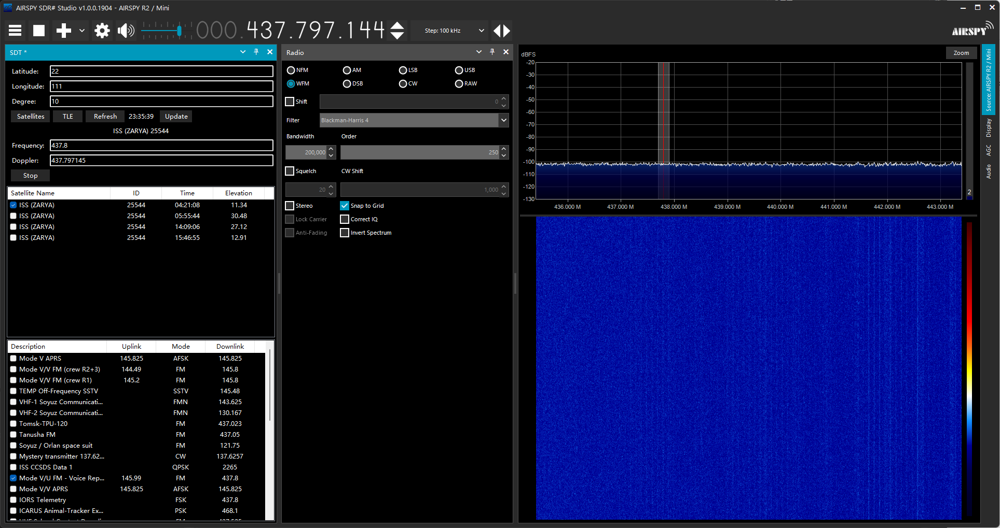

# SDRSharp.SDT: Satellite Doppler Tracker Plugin For SDR# / SDR#卫星多普勒追踪插件

## 介绍 / Introduction

### 中文

SDT是一个SDRSharp插件，这款插件可联网更新卫星TLE文件和频率信息，使用[SGP.NET](https://github.com/parzivail/SGP.NET)包预测卫星过境和多普勒效应计算，自动控制SDRSharp的频率。

### English

SDT (Satellite Doppler Tracker) is an SDR# plugin that can update satellites' TLE files and frequencies information online, using the [SGP.NET](https://github.com/parzivail/SGP.NET) to predict satellites transits and calculate the Doppler effect. It can control the frequency of SDR#.

## 特性 / Features

### 中文

- **预测卫星过境**: SDT可以预测选定的人造卫星的过境时间。
- **读取卫星频率信息**: SDT可以读取并显示选定的人造卫星的详细频率信息。
- **自动计算多普勒位移**: SDT可以计算出多普勒位移，并自动调整SDRSharp的频率。

### English

- **Predict satellite transits**: SDT can predict the transit times of the selected artificial satellite.
- **Read satellite frequency information**: SDT can read and display the detailed frequency information of the selected artificial satellite.
- **Automatic calculation of Doppler shift**: SDT can calculate the Doppler shift and adjust the frequency of SDRSharp accordingly.

## 安装 / Installation

### 中文

1. 从本页面下载最新版本的SDT的压缩文件SDT.zip。
2. 解压下载的文件，将其中的SDT文件夹复制到SDRSharp的plugins目录。
3. 启动SDRSharp，打开“插件管理”窗口，然后启用SDT插件。

### English

1. Download the latest version of the SDT compressed file SDT.zip from this page.
2. Unzip the downloaded file and copy the SDT folder into the plugins directory of SDRSharp.
3. Start SDRSharp, open the "Plugin Manager" window, and then enable the SDT plugin.

## 使用方法 / Usage

### 中文

1. 启动SDRSharp选取SDT插件。
2. 在SDT的界面中设置经纬度和角度。
3. 点击"Satellites"按钮选取你想要追踪的人造卫星。
4. 点击卫星可以显示选定卫星的频率信息。
5. 频率信息，SDT将自动计算多普勒位移。
6. 点击"Start"按钮自动控制SDRSharp频率。
7. "Update"按钮用于从网络更新卫星的TLE和信息。

### English

1. Start SDRSharp and enable the SDT plugin.
2. Input the latitude, longitude, and degree.
3. Click the "Satellites" button to select the satellite you want to track.
4. Select a satellite to show the frequency information.
5. Select a frequency, and SDT will automatically calculate the Doppler shift.
6. Click the "Start" button to enable the frequency control of SDRSharp.
7. The "Update" button is used to update the TLE and information of the satellite from the network.

## 许可证 / License

### 中文

本项目采用MIT许可证。详情请查看[LICENSE](LICENSE.txt)文件。

### English

This project is licensed under the MIT License. For more details, please check the [LICENSE](LICENSE.txt) file.

## Thanks
[SGP.NET](https://github.com/parzivail/SGP.NET)

[CelesTrak](https://celestrak.org/)

[SatNOGS](https://satnogs.org/)
